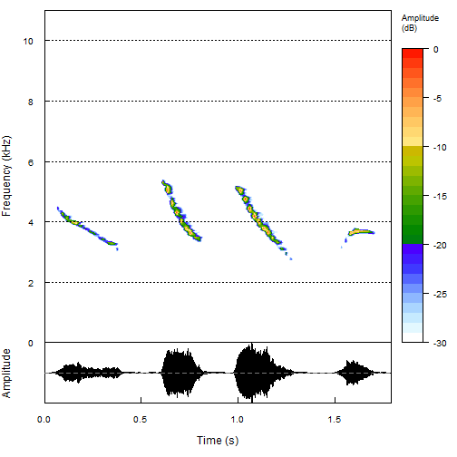

## Audio Analysis App: **Aaapp**

Linguistics students participating in acoustic signal processing courses need tools to grasp the importance of specificying particular parameters when analyzing acoustic signals. However, many of the software packages that allow them to manipulate audio files directly are very expensive. Even when licenses have been purchased, it is not always easy to ensure all students have access when and where they need it.

* Link to the [live Aaapp](https://phonetiker.shinyapps.io/CourseraDST9_audio/) on Shiny Apps  
* Link to the [code and data](https://github.com/Phonetiker/AudioAnalysis) on GitHub

Aaapp is an Audio Analysis App provides a solution to this dilemma. It provides students with a means to engage directly with analysis parameters of audio signals through an easy-to-use interface based entirely on freeware.

--- .class #id 

## What does it do?

**Aaap** allows users to choose from one of a variety of audio files and to analyze it selecting a shorter or longer analysis window. Users can select female or male voices saying short phrases or animals producing their calls. 

The sound is presented in two formats:

1. Waveform: pressure fluctuations of the sound 
2. Spectrogram: sound energy displayed across frequency (pitch) bands

By choosing different sounds and different analysis window lengths, students can see how the window length effects the kind of information made available by the analysis. A brief explanation is provided as part of the app, for quick reference.

--- &twocol .class #id 

## Example 

```
## Loading required package: seewave
```
*** =left


*** =right
* Example audio file: part of the `seewave` package
* Bottom panel shows waveform
* Top panel shows spectrogram
* Default window lenth used here   
    + (512 samples)
* Good window length for this sound file
* Temporal and frequency structure visible

--- &twocol .class #id 

## Benefits and technical details

*** =left
<h3>Benefits</h3>  
* Hosted on ShinyApps server: accessible to anyone with internet connection  
* Created using freeware `R`: `Shiny` and `seewave` packages (no proprietary software required) 
* Functional on smartphones: easy for students to access anywhere, anytime 
* Source code provided on Github

*** =right
<h3>Technical Details</h3>
* Standard `Shiny` functions such as `fluidPage`, `reactive` and `renderPlot` were used to structure the app  
* Small selection (9) of short audio files (<= 205 kB each) from [wavsource](http://www.wavsource.com/) downloaded as a zip file (< 400 kB) from [dropbox](https://www.dropbox.com)
* User selects audio files and analysis window lengths with radio button
* The spectogram updates automatically following each user selection 
